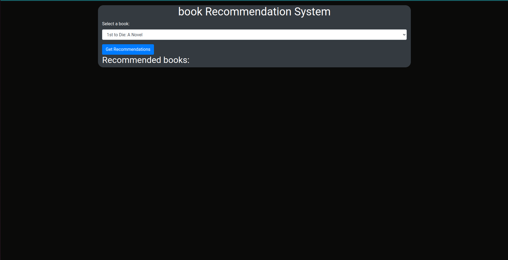
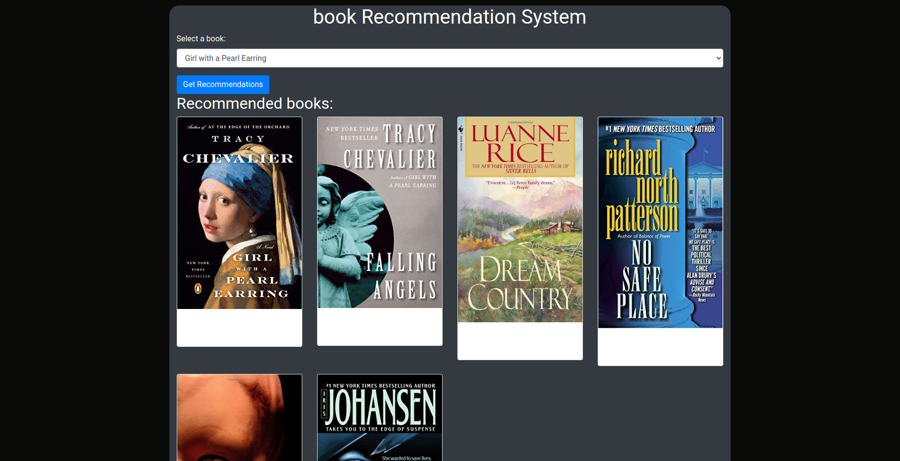

## Project: Book Recommender System | Approach : Collaborative Filtering Based | Backend : Flask


Welcome to our Book Recommender System! Powered by Collaborative Filtering, this project suggests personalized book recommendations based on user preferences. The backend is implemented using Flask for seamless integration. Enjoy discovering your next favorite read!

## Dataset has been used:

* [Dataset link](https://www.kaggle.com/ra4u12/bookrecommendation)

## How to Run
### STEPS:

Clone the repository

```bash
https://github.com/shivam1423/Book-Recommender-System-deploy
```

### STEP 01- install the requirements
```bash
pip install -r requirements.txt
```

Now run,
```bash
Python app.py
```
## Demo


